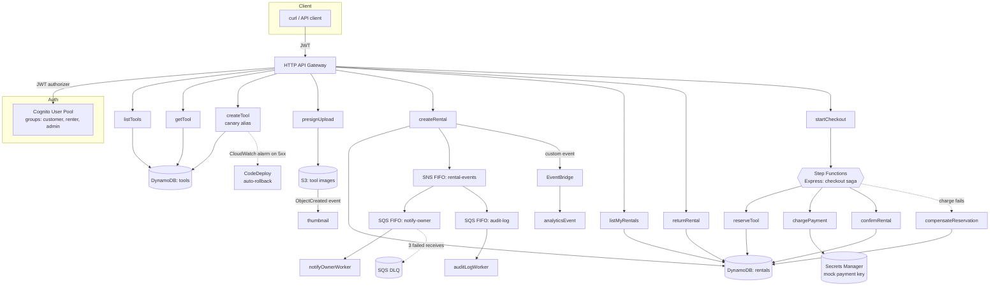
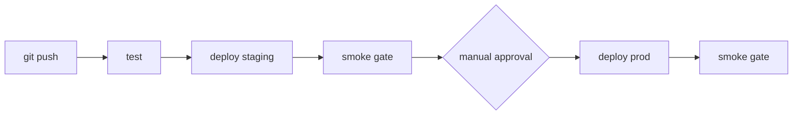

# ToolShare on AWS

Serverless re-platform of [db-toolshare](https://github.com/p1tap/db-toolshare)
(Next.js/Postgres marketplace) onto AWS, built CI/CD-first: the delivery
pipeline goes in on day one, and every feature after that ships to
production through it — canary deploy, automated smoke gate, manual
approval, automatic rollback on error.

## Architecture



## CI/CD



Runner: **GitHub Actions**, authenticated to AWS via **OIDC role
assumption** (`aws-actions/configure-aws-credentials`) — no long-lived
AWS keys stored in GitHub. The manual approval gate is a GitHub
`production` environment with a required reviewer.

Every deploy uses `sam deploy`, which drives **CodeDeploy canary
releases** on the `createTool` Lambda (`Linear10PercentEvery1Minute`)
with a CloudWatch alarm on function errors — if the new version starts
throwing during the 10%-traffic window, CodeDeploy automatically rolls
back before the rest of the traffic shifts. This is independent of
whatever runs the pipeline, so it works the same whether `sam deploy`
is invoked by GitHub Actions or a human at a terminal.

### Why GitHub Actions, not CodePipeline

The pipeline was originally built on **CodePipeline V2 + CodeBuild**
(`pipeline/pipeline-template.yaml` — still in this repo as reference).
It hit an account-level CodeBuild quota of **0 concurrent builds** —
not a visible Service Quotas value, but a separate new-account
fraud-prevention gate. AWS Support was engaged (case
178364607000836) and ultimately **declined** to raise it: *"quotas are
evaluated based on account history, usage patterns, and other
factors."*

Rather than block the project on an account-level decision outside my
control, I moved the CI runner to GitHub Actions, which needed no
quota and no CodeBuild at all. Everything downstream of "run the
pipeline steps" — `sam build`, `sam deploy`, the smoke gate script, the
canary/rollback mechanics — was already runner-agnostic, so the switch
touched only the pipeline's front door
(`.github/workflows/pipeline.yml` + `pipeline/github-oidc.yaml`), not
the application or its deployment strategy.

## Data model

Two DynamoDB tables, not single-table design — kept the schema legible
for anyone reading the repo, since Cognito already absorbed the "users"
concept.

| Access pattern | Table | Key |
|---|---|---|
| Get tool by id | `tools` | PK `toolId` |
| List tools by owner | `tools` | GSI `owner-index` (PK `ownerId`) |
| List all tools | `tools` | Scan (small demo dataset) |
| Get rental by id | `rentals` | PK `rentalId` |
| List rentals by renter | `rentals` | GSI `renter-index` (PK `renterId`) |
| List rentals by tool | `rentals` | GSI `tool-index` (PK `toolId`) |

Rental `status` (`requested → active → returned` / `failed`) drives the
Step Functions saga; payment info lives as attributes on the rental
record itself (mock gateway, no separate payments table).

## Identity

Cognito **is** the user store — no separate users table, no
hand-rolled password hashing. Roles are Cognito groups (`customer`,
`renter`, `admin`) carried in the JWT and checked in each Lambda. This
is the direct fix for two real issues in the original db-toolshare
repo: a hardcoded DB password fallback and a client-side role dropdown
that trusted the browser. See db-toolshare's README for that writeup.

## Module coverage (AWS Academy Cloud Developing, by feature)

| Module | Feature |
|---|---|
| M2 SDK | Lambda handlers on AWS SDK v3 |
| M3 Storage | S3 presigned upload/download + event source |
| M4 Secure access | Per-function least-privilege IAM in SAM |
| M5 NoSQL | DynamoDB on-demand + GSI |
| M6 REST APIs | HTTP API Gateway + Lambda |
| M7 Event-driven | S3 event thumbnailer + EventBridge custom events |
| M8 Containers | (planned) Fargate analytics service |
| M9 Caching | (planned) ElastiCache cache-aside |
| M10 Messaging | SNS FIFO fanout → SQS FIFO + DLQ |
| M11 Workflows | Step Functions saga with compensation |
| M12 Secure apps | Cognito + JWT authorizer + Secrets Manager |
| M13 CI/CD | GitHub Actions (OIDC) → staging → smoke gate → approval → prod → smoke gate, with CodeDeploy canary + alarm-triggered auto-rollback |

## Cost

Everything here is either free-tier or bills per request/per-minute —
nothing runs hourly at rest:

- Lambda, API Gateway (HTTP API), DynamoDB on-demand, S3, SQS, SNS,
  Step Functions Express, EventBridge: **$0 idle**, pennies per
  invocation/execution when exercised
- Secrets Manager: ~$0.40/month per secret (one secret)
- GitHub Actions: free for public repositories

No NAT Gateway, ALB, RDS, or always-on EC2 instances anywhere in this
stack.

## Local dev

```bash
npm install
npm test
sam build && sam deploy --config-env staging
API_URL=<stack ApiUrl output> npm run smoke
```

## Repo layout

- `template.yaml` — the application (API, Lambdas, DynamoDB, S3,
  Cognito, SNS/SQS, Step Functions, Secrets Manager)
- `pipeline/pipeline-template.yaml` — original CodePipeline/CodeBuild
  stack (kept as reference; account-level CodeBuild quota denial
  described above)
- `pipeline/github-oidc.yaml` — OIDC provider + deploy role assumed by
  GitHub Actions
- `.github/workflows/pipeline.yml` — the CI/CD pipeline
- `src/handlers/` — Lambda functions; `src/lib/` — shared auth/db/response
  helpers
- `statemachine/checkout.asl.json` — the checkout saga definition
- `tests/` — Vitest unit tests
- `scripts/smoke-test.mjs` — post-deploy smoke gate
- `scripts/teardown.ps1` / `scripts/audit.ps1` — stack teardown and
  cost/resource audit
