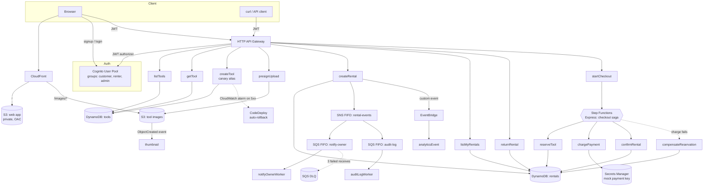
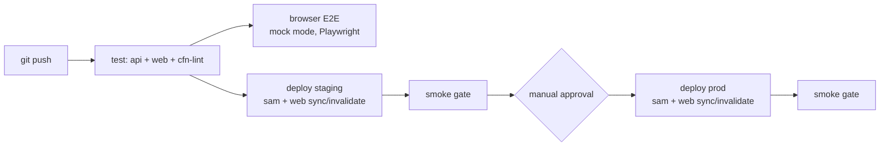

# ToolShare AWS

[](https://github.com/p1tap/toolshare-aws/actions/workflows/ci.yml)
[](https://github.com/p1tap/toolshare-aws/releases/latest)
[](https://d3sphfxaivnxo6.cloudfront.net)

A full-stack serverless tool-rental marketplace on AWS, built **CI/CD-first**:
the delivery pipeline was the first thing built, not the last, and every feature
since ships to production through it — canary deploy, smoke gate, manual
approval, automatic rollback on error. The web app and the API go through the
same pipeline.

## Architecture



## CI/CD



Both tiers ship together: the API deploys via `sam deploy` (CodeDeploy
canary on the write path), then the web app is built per stage from the
live stack outputs and published as an atomic `s3 sync` + CloudFront
invalidation. A Playwright suite drives a real browser through the app's
mock mode on every push (independent of the deploy jobs, since it needs
no AWS) — signup → verify → list a tool → rent → checkout-fail →
compensate → retry → return. See [`web/README.md`](web/README.md#browser-e2e-playwright).

Release runner: **AWS CodePipeline V2 + CodeBuild**, sourced from GitHub
through an authorized CodeConnection. CodeBuild deploys through a scoped
service role; no AWS keys are stored in GitHub. The production gate is a
native CodePipeline manual-approval action.

The branch workflow in GitHub Actions remains CI-only: it publishes visible
repository checks for the backend/frontend build, unit tests, template lint,
and mock-mode browser journey. It never deploys, so there is one canonical
deployment pipeline.

Version tags add a separate provenance gate: `.github/workflows/release.yml`
repeats the complete test/build/lint/browser suite, verifies that the tag
matches `package.json`, packages the production web build with a SHA-256
checksum, and publishes both to GitHub Releases. A GitHub Release records a
known-good version; it does not bypass or duplicate the AWS deployment path.
Release changes are tracked in [`CHANGELOG.md`](CHANGELOG.md).

Every deploy uses `sam deploy`, which drives **CodeDeploy canary
releases** on the `createTool` Lambda (`Linear10PercentEvery1Minute`)
with a CloudWatch alarm on function errors — if the new version starts
throwing during the 10%-traffic window, CodeDeploy automatically rolls
back before the rest of the traffic shifts. This is independent of
whatever runs the pipeline, so it works the same whether `sam deploy`
is invoked by CodeBuild or a human at a terminal.

## Web app

`web/` — React + Vite + TypeScript SPA (Tailwind, react-router). Hosted on
a **private** S3 bucket behind CloudFront (Origin Access Control); tool
photos are served by the same distribution under `/images/*` from the
(also private) images bucket, with a viewer-request CloudFront Function
stripping the prefix. Auth is Cognito `USER_PASSWORD_AUTH` called
directly with `fetch` — no AWS SDK in the browser bundle.

Runs fully offline in mock mode (`cd web && npm run dev`, zero config):
seeded marketplace, simulated auth, and a checkout whose first payment
attempt deliberately fails so the saga's compensation path is always
demonstrable. Details in [`web/README.md`](web/README.md).

Live URL: **https://d3sphfxaivnxo6.cloudfront.net**

## Data model

Two DynamoDB tables, not single-table design — kept the schema legible
for anyone reading the repo, since Cognito already absorbed the "users"
concept.

| Access pattern | Table | Key |
|---|---|---|
| Get tool by id | `tools` | PK `toolId` |
| List tools by owner | `tools` | GSI `owner-index` (PK `ownerId`) |
| List all tools | `tools` | Scan (small demo dataset) |
| Get rental by id | `rentals` | PK `rentalId` |
| List rentals by renter | `rentals` | GSI `renter-index` (PK `renterId`) |
| List rentals by tool | `rentals` | GSI `tool-index` (PK `toolId`) |

Rental `status` (`requested → reserved → active → returned`, with failed
payment compensated back to `requested`) drives the Step Functions saga;
payment info lives as attributes on the rental record itself (mock gateway,
no separate payments table).

## Identity

Cognito **is** the user store — no separate users table, no hand-rolled
password hashing. API Gateway validates the JWT, and Lambdas derive ownership
from its `sub` claim rather than trusting request bodies. Any verified user
can list and rent tools; the `admin` group is recognized only for the
return-rental override.

## Module coverage (AWS Academy Cloud Developing, by feature)

| Module | Feature |
|---|---|
| M2 SDK | Lambda handlers on AWS SDK v3 |
| M3 Storage | S3 presigned upload/download + event source |
| M4 Secure access | Per-function least-privilege IAM in SAM |
| M5 NoSQL | DynamoDB on-demand + GSI |
| M6 REST APIs | HTTP API Gateway + Lambda |
| M7 Event-driven | S3 event thumbnailer + EventBridge custom events |
| M10 Messaging | SNS FIFO fanout → SQS FIFO + DLQ |
| M11 Workflows | Step Functions saga with compensation |
| M12 Secure apps | Cognito + JWT authorizer + Secrets Manager |
| M13 CI/CD | CodePipeline/CodeBuild → staging → smoke gate → approval → prod → smoke gate, with CodeDeploy canary + alarm-triggered auto-rollback |

## Cost

Everything here is either free-tier or bills per request/per-minute —
nothing runs hourly at rest:

- Lambda, API Gateway (HTTP API), DynamoDB on-demand, S3, SQS, SNS,
  Step Functions Express, EventBridge: **$0 idle**, pennies per
  invocation/execution when exercised
- Secrets Manager: two small stage-specific secrets (the only fixed monthly
  storage charge in the application stacks)
- CodePipeline and CodeBuild: usage-based release cost; nothing runs at rest

No NAT Gateway, ALB, RDS, or always-on EC2 instances anywhere in this
stack.

## Local dev

```bash
npm install
npm test
sam build && sam deploy --config-env staging
API_URL=<stack ApiUrl output> npm run smoke
```

## Repo layout

- `template.yaml` — the application (API, Lambdas, DynamoDB, S3,
  Cognito, SNS/SQS, Step Functions, Secrets Manager, CloudFront web tier)
- `web/` — the React/TypeScript web app (see `web/README.md`)
- `pipeline/pipeline-template.yaml` — CodePipeline/CodeBuild release stack
- `.github/workflows/ci.yml` — CI-only public repository checks
- `src/handlers/` — Lambda functions; `src/lib/` — shared auth/db/response
  helpers
- `statemachine/checkout.asl.json` — the checkout saga definition
- `tests/` — Vitest unit tests
- `web/e2e/` — Playwright browser E2E, mock mode (see `web/README.md`)
- `scripts/smoke-test.mjs` — post-deploy smoke gate
- `scripts/teardown.ps1` / `scripts/audit.ps1` — stack teardown and
  cost/resource audit
